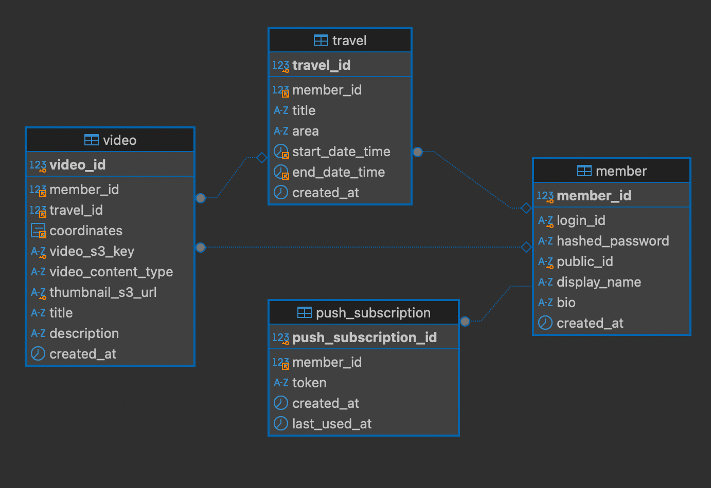
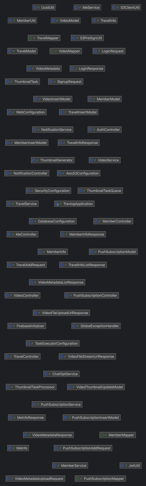
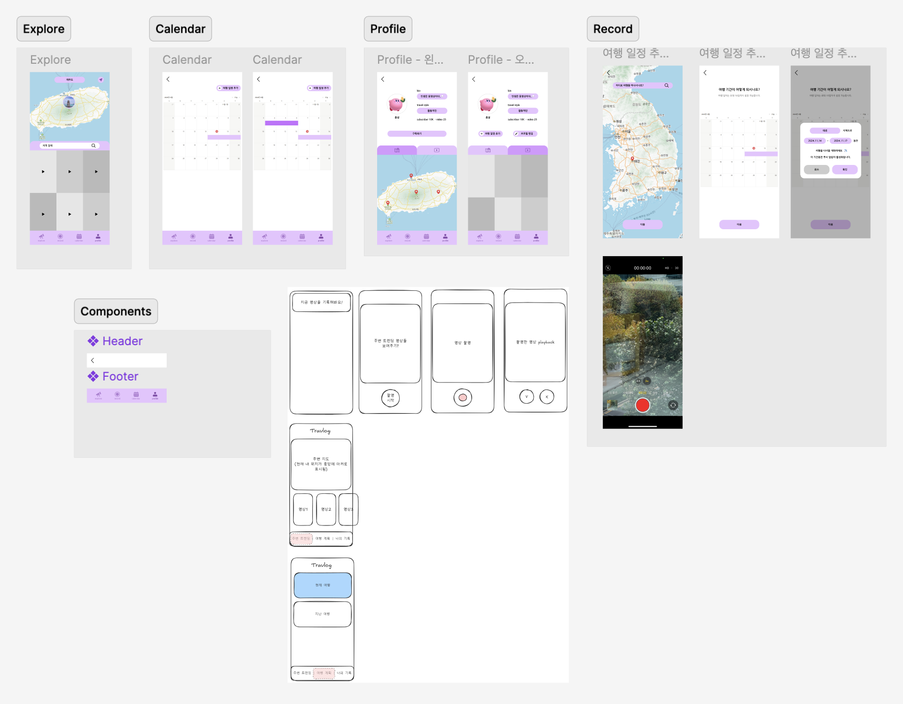

# SSAFY 12기 14반 7조

## 팀원 및 역할 소개

- 팀장: 홍권
  - ERD 설계
  - Spring Boot API server 구현
  - EC2에 BE, DB 서버 컨테이너로 배포

- 팀원: 김서로
  - 디자인 및 화면 설계
  - Vue.js로 SPA WebApp 구현
  - Netlify로 SPA 배포

## 서비스 개요

Susucup, 여행의 순간을 담아 나만의 브이로그로.

- 여행의 작은 매순간들을 영상으로 담게 해주는 플랫폼
- 여행지에서의 추억을 타인과 함께 공유하는 커뮤니티

## 서비스 기능 개요

### 영상 촬영 및 공유

- 영상 촬영 후 서비스에 업로드 가능
- 업로드 시 그 순간의 위치도 함께 업로드 되어 추후 영상 탐색 시 활용됨

### 촬영 알림

- 유저가 여행 중인 경우 일정한 주기로 촬영을 하라는 푸시 알림을 보냄

### 위치 기반 영상 조회

- 현재 위치 주변에서 업로드 된 영상 확인 가능
- 지도 탐색 및 장소 검색을 통해 해당 위치 주변의 영상 확인 가능

## 요구사항 정의서

| 도메인   | 기능 명                        |
| -------- | ------------------------------ |
| `Member` | 회원가입                       |
| `Member` | 로그인                         |
| `Member` | 로그아웃                       |
| `Video`  | 비디오 파일 저장               |
| `Video`  | 비디오 파일 조회               |
| `Video`  | 비디오 메타 데이터 저장        |
| `Video`  | 비디오 메타 데이터 조회        |
| `Video`  | 특정 유저의 비디오 리스트 조회 |
| `Video`  | 특정 여행의 비디오 리스트 조회 |
| `Video`  | 특정 장소의 비디오 리스트 조회 |
| `Travel` | 여행 일정 저장                 |
| `Travel` | 여행 일정 조회                 |

## 다이어그램

### Entity Relationship Diagram

### Class Diagram

### Figma Diagram

